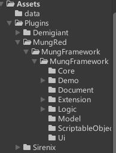

# MungFramework 上手指南

有空再写

## 一. 准备工作

### 1.创建Unity工程

### 2.导入依赖插件

依赖项

1. Unity InputSystem
2. Odin
3. DOTween Pro
4. TextMeshPro
5. Core RP Library
6. Unity Ui Toolkit

### 3.导入MungFramework

框架在Unity工程中的位置应该如下

Assets/Plugins/MungRed/MungFramework

## 二. 为游戏创建标题场景

## 三. 为游戏创建主场景并制作玩法
