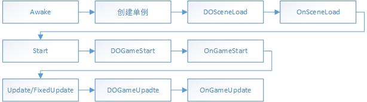
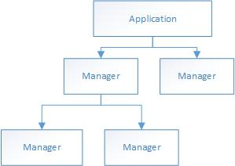
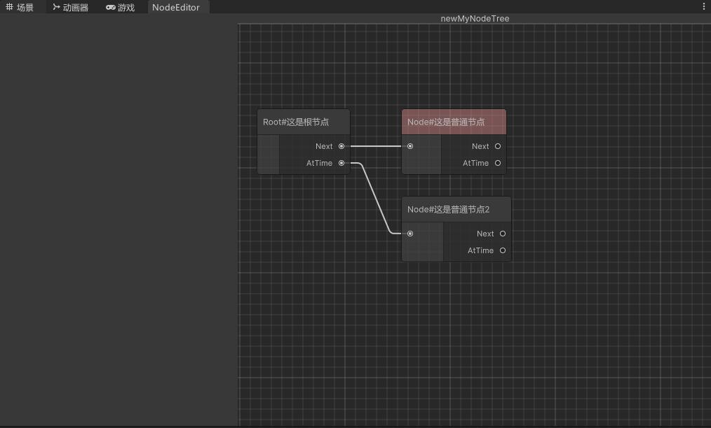

# MungFramework 开发文档

有空再写

## 模块详细

### Logic

该模块表示游戏运行逻辑

#### GameApplication

游戏的入口，控制游戏开始，循环，结束，暂停等事件

约束：

1. 子管理器或者子执行器能够通过单例调用GameApplication中的事件。例如控制游戏暂停。但禁止在子管理器中的OnXXX中调用GameApplication中的DOXXX或OnXXX，否则会导致无限递归。例如不能在某个子管理器的OnPause中调用Application中的DOPause或者OnPause。
2. GameApplication的子节点为游戏的基础管理器，例如输入，存档，音频等，执行通用逻辑。

执行流程图



#### GameManager

GameManager:游戏管理器抽象类

GameSaveableManager:继承自游戏管理器抽象类，可被存档系统保存和读取，会在OnSceneLoad中将自己添加至SaveManager中。必须实现Save和Load抽象方法。
>Save():将某些数据储存至当前存档中，但不会保存至硬盘，一般由SaveManager进行调用。
>Load():从当前存档中读取某些数据，一般在需要使用数据时调用。

管理器与执行器的树形结构示意图：



#### InputManager

游戏中的输入管理

#### SaveManager

游戏中的存档管理

#### SoundManager

游戏中的音频管理

### Model

该模块代表游戏中的模型

Model：模型抽象类

SOModelStream：从SO到模型的数据流节点抽象类

ModelModelStream：从Model到Model的数据流节点抽象类

### Extension

该模块提供对Unity的扩展

#### ComponentExtension

>提供Unity的组件扩展，例如给RectTransform添加自定义方法

#### EditorExtension

>Unity的编辑器扩展，例如自定义右键菜单创建MD文件

##### FileCreater

参照示例代码添加创建指定格式文件的方法

```cs
//右键菜单创建.md文件
[MenuItem("Assets/MungFramework/创建MD文件")]
public static void CreateMarkdownFile()
{
    string path = AssetDatabase.GetAssetPath(Selection.activeObject);
    if (path == "")
    {
        path = "Assets";
    }
    else if (System.IO.Path.GetExtension(path) != "")
    {
        path = path.Replace(System.IO.Path.GetFileName(AssetDatabase.GetAssetPath(Selection.activeObject)), "");
    }
    string fileName = "NewMarkdownFile.md";
    string fullPath = AssetDatabase.GenerateUniqueAssetPath(path + "/" + fileName);
    System.IO.File.WriteAllText(fullPath, "");
    AssetDatabase.Refresh();
}
```

##### DataSOEditorWindow

>SO文件编辑器

>功能：打开窗口后可以编辑所有同类型的SO文件

参考示例代码创建SO编辑器类

```cs
public class TestEditor : DataSOEditorWindow<SOTest>
{
    public override string Title=>"Test";
    public override string Path=> "Assets";

    [MenuItem("配置/测试配置文件")]
    public static void OpenWindow()
    {
        var window = GetWindow<TestEditor>();
        window.position = GUIHelper.GetEditorWindowRect().AlignCenter(1280, 720);
        window.titleContent = new GUIContent("Test");
    }
}
```

#### ActionTreeEditor

>基于孩子兄弟二叉树的行为树

行为树示意图:



>○  该行为树中，每个节点有两个子节点，分别是“Next”节点与“AtTime”节点
○  Next节点表示当前节点完成后需要执行的下一个节点，AtTime节点表示与当前节点同时执行的节点
○  AtTime节点也可作为分支使用，例如当前节点不满足执行条件，则执行AtTime节点
○  对于“同时执行”的用法，则可以分为“同步同时”与“异步同时”,即当前节点是否需要等待同时执行的内容完成后才进入下一节点
○  通过以上条件配合，能够完成的游戏流程、演出、对话以及技能等配置

一般来说 行为树的递归执行流程为

```cs
DO(Node CurrentNode){
    1. 执行 CurrentNode 的事件
    2. DO(CurrentNode->AtTime)
    3. 如果同步同时，则等待1，2步全部结束
    4. DO(Current->Next)
}
```

使用方式:

参考示例代码创建行为树类和节点类
>请确保行为树类和节点类在同一命名空间下

```cs
using MungFramework.ActionTreeEditor;
namespace Mung.Name1
{
    [CreateAssetMenu(fileName ="newMyNodeTree",menuName ="行为树/行为树1")]
    public class MyNodeTree : ActionNodeTree
    {
    }
}

using MungFramework.ActionTreeEditor;
namespace Mung.Name1
{
    public class MyNode1 : ActionNode
    {
        public override NodeType _NodeType => NodeType.Node;
        public override string NodeTitle => "Node#"+备注;
    }
}

using MungFramework.ActionTreeEditor;
namespace Mung.Name1
{
    public class MyNode2 : ActionNode
    {
        public override NodeType _NodeType => NodeType.Root;
        public override string NodeTitle => "Root#"+备注;
    }
}
```

>1. 在资源窗口中右键创建相应的行为树SO文件
>2. 双击打开节点编辑器窗口
>3. 在节点编辑器窗口中右键创建相应的节点
>4. 点击节点进行编辑
>5. 自定义行为树执行器，引用行为树文件执行相应的事件

### Core

该模块提供对操作系统，文件系统等方面的底层接口。

#### FileSystem

提供文件读写方法

#### Database

该类对文件读写类进一步封装，提供对数据库的操作

约束:

1. 数据库由若干个数据表组成，其中system表为数据库自带的表
2. 每个数据表由若干个键值对组成，其中键不可以重复

### ScriptableObjects

该模块提供对SO文件的管理

SO文件约束：

1. SO文件用于储存游戏中一些静态的数据，例如一个角色的初始数值，成长数值等；
2. 在运行中不允许修改SO文件，只能通过SO文件来创建游戏中的模型；

#### DataSO

SO文件的抽象类

参照示例创建SO类

```cs
[CreateAssetMenu(fileName = "newSOTest", menuName = "SO/SOTest")]
public class SOTest : DataSO{
  //在这扩展
}
```

#### DataSOList

对同类SO文件的管理抽象类

参考示例代码创建 DataSOList类

```cs
[CreateAssetMenu(fileName = "newsolist", menuName = "SO/SOList")]
public class SOListTest : DataSOList<SOTest>
{
    //在这扩展
}
```
