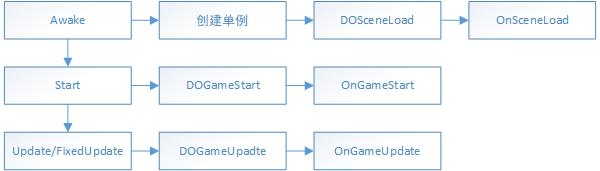
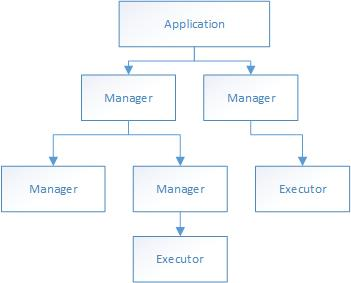
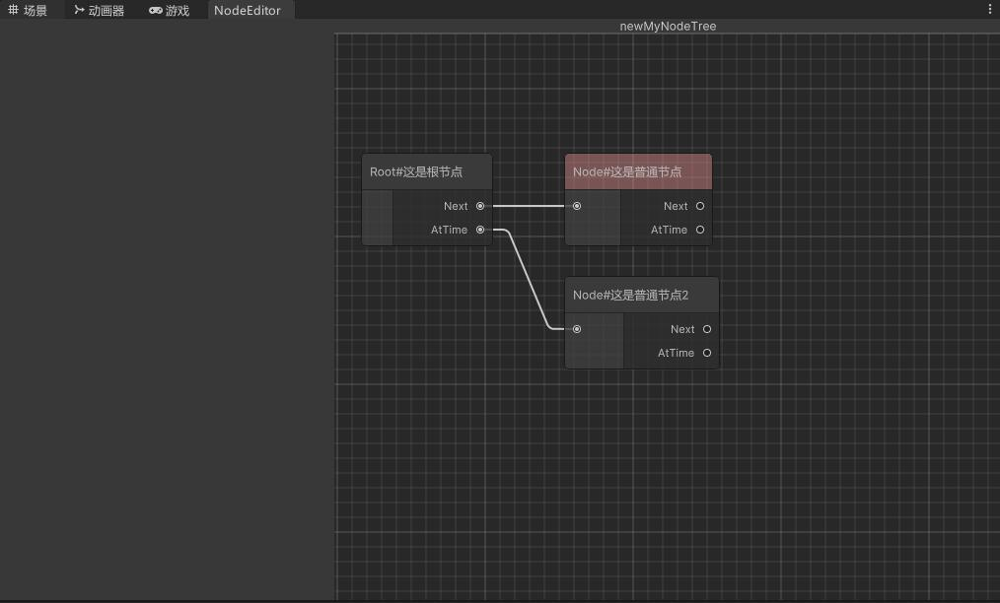

# MungFramework Unity游戏开发框架
>
>作者 bilibili@MungRed

## 前言

“抽象在一定程度上确实能提高程序的灵活性，前提是你需要这个灵活性”
如果一个类抽象到能够表示一切，那么实际上这个类什么也干不了，反而违背了继承所带来的代码复用的好处。

市面上一些游戏框架采用web网页的设计方法，例如面向接口，MVC等设计方法。虽然程序耦合降下去了，反而太过于抽象不是很好用。
例如MVC设计模式，如果游戏中的Ui表示View，实际上不是很合理，因为有时候Ui也会成为游戏玩法的一部分，会不可避免地与游戏玩法耦合。如果将玩家在屏幕上看到的一切都当作View，那View就太过庞大和复杂。

既然游戏程序耦合不可避免，那么就通过合理的约束等方式，让游戏程序的耦合更容易被人理解，本框架致力于完成这样一种游戏程序。

## 框架介绍

本框架适用于PC角色扮演游戏的快速开发。
本框架使用抽象类而不是接口，这样能够提供一定量的代码复用。

## 依赖项

1. Unity InputSystem
2. Odin
3. DOTween Pro
4. TextMeshPro
5. Core RP Library
6. Unity Ui Toolkit

## 框架示意图


## 快速开始

### 准备阶段

将MungFramework导入到`/Assets/Plugins`目录下，并尝试修复可能的错误

### 为游戏添加基础运行代码

### 添加角色管理器和角色控制器

### 添加数值管理器

### 添加战斗模块

## 模块详细

### Logic

该模块表示游戏运行逻辑

#### GameApplication

游戏的入口，控制游戏开始，循环，结束，暂停等事件

约束：

1. 子管理器或者子执行器能够通过单例调用GameApplication中的事件。例如控制游戏暂停。但禁止在子管理器中的OnXXX中调用GameApplication中的DOXXX或OnXXX，否则会导致无限递归。例如不能在某个子管理器的OnPause中调用Application中的DOPause或者OnPause。
2. GameApplication的子节点为游戏的基础管理器，例如输入，存档，Ui等，执行通用逻辑。

字段字典

|字段|类型|访问级别|备注|
|-|-|-|-|
|Instance|GameApplication|public static|单例对象，确保场景中只有一个GameApplication|
|@InputManager|InputManager|public|输入管理器，基础管理器之一|
|@SaveManager|SaveManager|public|存档管理器，基础管理器之一|

执行流程图



#### GameManager

GameManager:游戏管理器抽象类

GameSaveableManager:继承自游戏管理器抽象类，可被存档系统保存和读取，会在OnSceneLoad中将自己添加至SaveManager中。必须实现Save和Load抽象方法。
>Save():将某些数据储存至当前存档中，但不会保存至硬盘，一般由SaveManager进行调用。
>Load():从当前存档中读取某些数据，一般在需要使用数据时调用。

GameExecutor:游戏执行器抽象类，用于执行某个游戏逻辑，受GameManager管理

管理器与执行器的树形结构示意图：



约束：

1. 游戏管理器不应承担详细的逻辑任务，例如：战斗管理器只能控制战斗的开始和结束等事件，不能用于操控角色，而操控角色应分配给战斗管理器下的操控执行器。
2. 在管理器与执行器的树形结构中，执行器只能当作叶节点。
3. 树形结构图为有向无环图，且除根节点(Application节点)外，每个节点的入度为1

#### InputManager

游戏中的输入管理

#### SaveManager

游戏中的存档管理

### Model

该模块代表游戏中的模型

#### Model

模型抽象类

#### SOModelStream

从SO到模型的数据流节点抽象类

#### ModelModelStream

从Model到Model的数据流节点抽象类

### Extend

该模块提供对Unity的扩展

#### ComponentExtend

>提供Unity的组件扩展，例如给RectTransform添加自定义方法

#### EditorExtend

>Unity的编辑器扩展，例如自定义右键菜单创建MD文件

##### FileCreater

参照示例代码添加创建指定格式文件的方法

```cs
//右键菜单创建.md文件
[MenuItem("Assets/MungFramework/创建MD文件")]
public static void CreateMarkdownFile()
{
    string path = AssetDatabase.GetAssetPath(Selection.activeObject);
    if (path == "")
    {
        path = "Assets";
    }
    else if (System.IO.Path.GetExtension(path) != "")
    {
        path = path.Replace(System.IO.Path.GetFileName(AssetDatabase.GetAssetPath(Selection.activeObject)), "");
    }
    string fileName = "NewMarkdownFile.md";
    string fullPath = AssetDatabase.GenerateUniqueAssetPath(path + "/" + fileName);
    System.IO.File.WriteAllText(fullPath, "");
    AssetDatabase.Refresh();
}
```

##### DataSOEditorWindow

>SO文件编辑器

>功能：打开窗口后可以编辑所有同类型的SO文件

参考示例代码创建SO编辑器类

```cs
public class TestEditor : DataSOEditorWindow<SOTest>
{
    public override string Title=>"Test";
    public override string Path=> "Assets";

    [MenuItem("配置/测试配置文件")]
    public static void OpenWindow()
    {
        var window = GetWindow<TestEditor>();
        window.position = GUIHelper.GetEditorWindowRect().AlignCenter(1280, 720);
        window.titleContent = new GUIContent("Test");
    }
}
```

#### ActionTreeEditor

>行为树编辑器

行为树示意图:



>Next节点代表下一节点
AtTime节点代表同时进行的节点

一般来说 行为树的递归执行流程为

```cs
DO(Node CurrentNode){
    1. 执行 CurrentNode 的事件
    2. DO(CurrentNode->AtTime)
    3. 直到1，2步全部结束
    4. DO(Current->Next)
}
```

使用方式:

参考示例代码创建行为树类和节点类
>请确保行为树类和节点类在同一命名空间下

```cs
using MungFramework.ActionTreeEditor;
namespace Mung.Name1
{
    [CreateAssetMenu(fileName ="newMyNodeTree",menuName ="行为树/行为树1")]
    public class MyNodeTree : ActionNodeTree
    {
    }
}

using MungFramework.ActionTreeEditor;
namespace Mung.Name1
{
    public class MyNode1 : ActionNode
    {
        public override NodeType _NodeType => NodeType.Node;
        public override string NodeTitle => "Node#"+备注;
    }
}

using MungFramework.ActionTreeEditor;
namespace Mung.Name1
{
    public class MyNode2 : ActionNode
    {
        public override NodeType _NodeType => NodeType.Root;
        public override string NodeTitle => "Root#"+备注;
    }
}
```

>1. 在资源窗口中右键创建相应的行为树SO文件
>2. 双击打开节点编辑器窗口
>3. 在节点编辑器窗口中右键创建相应的节点
>4. 点击节点进行编辑
>5. 自定义行为树执行器，引用节点树文件执行相应的事件

### Core

该模块提供对操作系统，文件系统，网络通信方面的底层接口。

#### FileSystem

>该类提供文件读写方法

|属性|类型|访问级别|备注|
|-|-|-|-|
|GlobalEncoding|Encoding|private readonly|指定全局编码格式|

|方法|返回值|参数|访问级别|备注|
|-|-|-|-|-|
|HasDirectory|bool|string path|public|返回是否存在路径|
|HasFile|bool|string path, string filename, string format|public|返回是否存在文件|
|ReadFile|string,bool|string path,string filename,string format|public|将文件内容读取为字符串|
|WriteFile|bool|string path,string filename,string format, string content|public|字符串写入文件|
|DeleteFile|bool|string path, string filename, string format|public|文件删除|
|LockFile|void|byte[] bytes, LockOperate op|private|字件加密方法|

#### DataBase

>该类对文件读写类进一步封装，提供对数据库的操作

约束:

1. 数据库由若干个数据表组成，其中system表为数据库自带的表
2. 每个数据表由若干个键值对组成，其中键不可以重复

|方法|返回值|参数|访问级别|备注|
|-|-|-|-|-|
|ExistDataBase|bool||public|检查数据库是否存在|
|CreateDataBase|bool||public|创建数据库|
|GetDataTable|DataTable, bool|string tableName|private|获取数据表|
|RemoveDataTable|bool|string tableName|public|移除数据表|
|GetKeyValues|List<KeyValuePair<string, string>>, bool|string tableName|public|获得某个数据表中的所有键值对|
|SetKeyValues|void|string tableName, List<KeyValuePair<string, string>> keyValues|public|设置某个数据表中的所有键值对|

##### 内部类 DataTable

>该类表示一个数据表

|字段|类型|访问级别|备注|
|-|-|-|-|
|TableName|string|public|数据表的名字|
|DataDictionary|SerializedDictionary<string, string>|public|数据键值对|

|方法|返回值|参数|访问级别|备注|
|-|-|-|-|-|
|GetKeyValues|List<KeyValuePair<string, string>>||public|获取所有键值对|
|SetKeyValues|void|List<KeyValuePair<string, string>> keyvalues|public|设置键值对|

### ScriptableObjects

该模块提供对SO文件的管理

SO文件约束：

1. 同类型的SO文件应放在统一的位置；
2. SO文件用于储存游戏中一些静态的数据，例如一个角色的初始数值，成长数值等；
3. 在运行中不允许修改SO文件，只能通过SO文件来创建游戏中的实例；

#### DataSO

>SO文件的抽象类

|字段|类型|访问级别|备注|
|-|-|-|-|
|id|string|public||

参照示例创建SO类

```cs
[CreateAssetMenu(fileName = "newSOTest", menuName = "SO/SOTest")]
public class SOTest : DataSO{
  //在这扩展
}
```

#### DataSOList

>对同类SO文件的管理抽象类

|字段|类型|访问级别|备注|
|-|-|-|-|
|TList|List\<DataSOItem>|protected|储存同类的SO文件|

|属性|类型|访问级别|备注|
|-|-|-|-|
|TTypeName|string|private|T的名字|

|检视器方法|返回值|访问级别|备注|
|-|-|-|-|
|GetAllSO|void|private|获取所有的同类SO文件,然后排序|
|SortList|void|private|先应用id，然后对id排序|
|CheckID|void|private|检查id重复性和正确性(自动去掉id中的空格)，然后应用id|
|ApplyID|void|private|对所有item应用id|

参考示例代码创建 DataSOList类

```cs
[CreateAssetMenu(fileName = "newsolist", menuName = "SO/SOList")]
public class SOListTest : DataSOList<SOTest>
{
    //在这扩展
}
```

##### 内部类 DataSOItem

>表示一个SO文件

|字段|类型|访问级别|备注|
|-|-|-|-|
|id|string|public|id值|
|item|T:DataSO|public|储存对应SO的实现|
