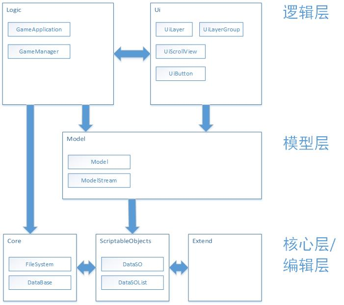

# MungFramework 简介

>作者 bilibili@MungRed

## 前言

“抽象在一定程度上确实能提高程序的灵活性，前提是你需要这个灵活性”

在游戏开发中，程序间的耦合不可避免，如果强行用Web的开发思路来降低程序耦合，反而会导致程序难以调试和理解

本框架采用合理的约束来实现 “容易理解的耦合” ，试图为游戏开发提供新的思路。

## 特点

1. 适用于PC角色扮演游戏的快速开发；
2. 现代化的代码风格，容易理解；
3. 使用抽象类而不是接口，能够提供一定量的代码复用，减低代码编写量；

## 依赖项

1. Unity InputSystem
2. Odin
3. DOTween Pro
4. TextMeshPro
5. Core RP Library
6. Unity Ui Toolkit

## 框架示意图

## 如何使用

[上手指南](./MungFramework/ReadMe/上手指南.md)
[文档](./MungFramework/ReadMe/文档.md)
