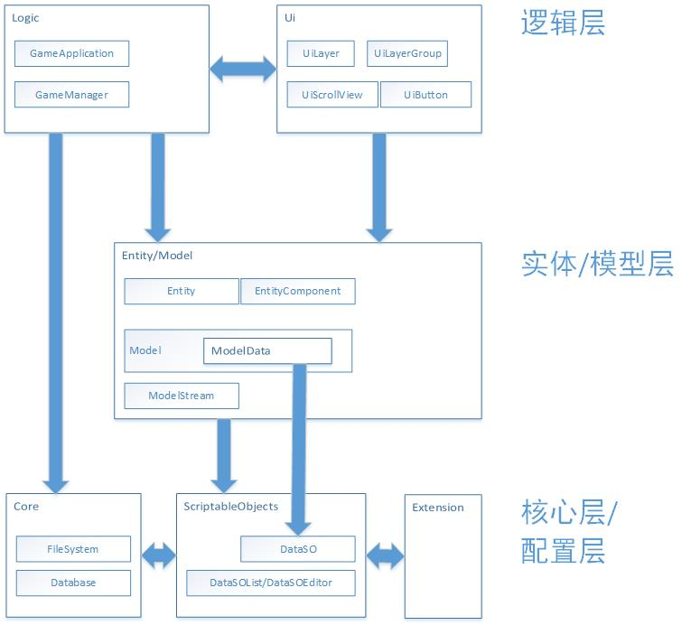

# MungFramework 简介

>作者 bilibili@MungRed

## 特点

1. 适用于PC单机游戏的快速开发；
2. 清晰的代码风格，容易理解；
3. 提供一定量的代码复用，只需要实现抽象类即可实现大部分功能，减少代码编写量；

## 依赖项

1. Unity InputSystem
2. Odin
3. DOTween Pro
4. TextMeshPro
5. Core RP
6. Unity Ui Toolkit

>注：本框架不提供依赖项的源代码，请自行安装

## 框架示意图

## 如何使用

[上手指南](./MungFramework/Document/上手指南.md)

[文档](./MungFramework/Document/文档.md)
